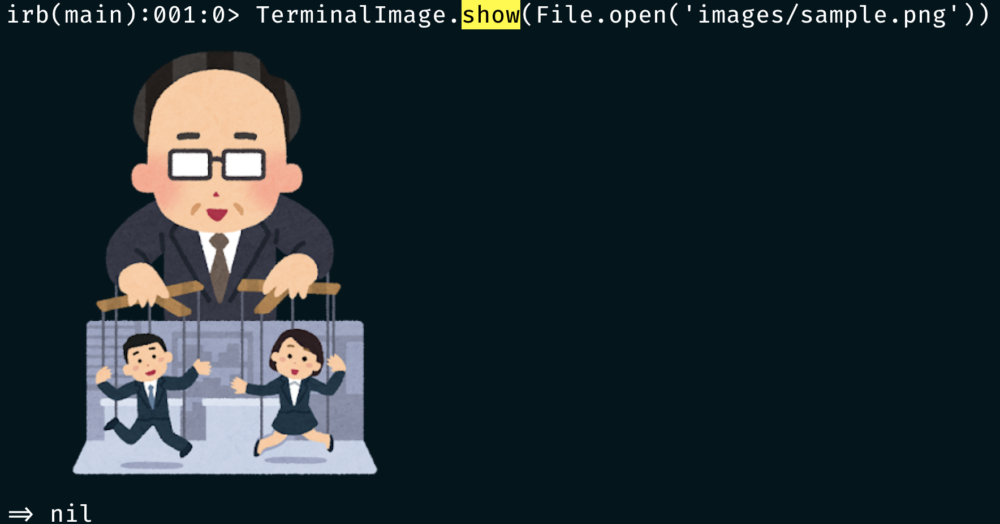

# TerminalImage

TerminalImage is a library to show images on terminals. 



## Installation

Add this line to your application's Gemfile:

```ruby
gem 'terminal_image'
```

## Usage

```ruby
file = File.open('your-image-path.png')
TerminalImage.show(file) # will show image on your terminal
```

## Contributing

Bug reports and pull requests are welcome on GitHub at https://github.com/unhappychoice/terminal_image. This project is intended to be a safe, welcoming space for collaboration, and contributors are expected to adhere to the [Contributor Covenant](http://contributor-covenant.org) code of conduct.

## License

The gem is available as open source under the terms of the [MIT License](https://opensource.org/licenses/MIT).

## Code of Conduct

Everyone interacting in the TerminalImage project’s codebases, issue trackers, chat rooms and mailing lists is expected to follow the [code of conduct](https://github.com/unhappychoice/terminal_image/blob/master/CODE_OF_CONDUCT.md).
